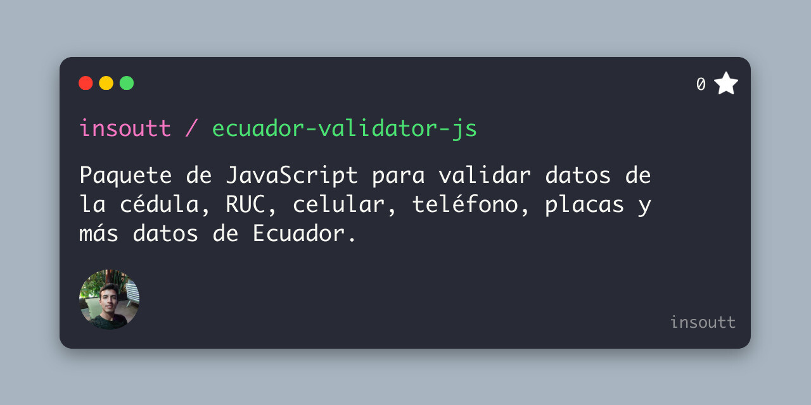

<a name="readme-top"></a>
<div align="center">
  
  <h1>Ecuador Validator Javascript</h1>

  <p>
    Paquete de JavaScript para validar datos de la cédula, RUC, celular, teléfono, placas y más datos de Ecuador.
  </p>
</div>

## Getting Started

### Installation
Install the package with npm:
```bash
npm install ecuador-validator
```

## Getting Started

You can import the validator in your project with the following code:
```js
const validator = require('ecuador-validator');
```
Or with ES6:
```js
import validator from 'ecuador-validator';
```

## Usage
Validator is available with the following methods:
```ts
validator.ci(ci: string): boolean;
validator.ruc(ruc: string): boolean;
validator.cellphone(cellphone: string, type?: 'simple' | 'code'): boolean;
validator.telephone(telephone: string, type?: 'simple' | 'code' | 'international'): boolean;
validator.placaCar(placa: string): boolean;
validator.placaMoto(placa: string): boolean;
```
And you can use it like this:
```js
validator.cedula('1723456789'); // true
validator.ruc('1723456789001'); // true
validator.celular('0991234567'); // true
validator.telefono('022123456'); // true
validator.placaCar('ABC-123'); // false
validator.placaCar('ABC0123'); // true
validator.placaMoto('AA012E'); // true
```

## Run Locally

1. Clone the repo
   ```sh
   git clone https://github.com/your_username_/Project-Name.git
   ```
2. Install NPM packages
   ```sh
   npm install
   ```
3. Edit the `index.js` file
### Running Tests

To run tests, run the following command

```bash
  npm run test
```

<!-- CONTACT -->
## Contact

Elvis Fernando - [@insoutt](https://twitter.com/insoutt) - [Website](https://elvisfernando.com)

Project Link: [https://github.com/insoutt/ecuador-validator-js](https://github.com/insoutt/ecuador-validator-js)

<p align="right">(<a href="#readme-top">back to top</a>)</p>
